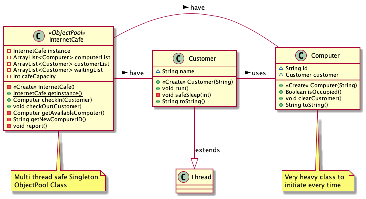

= *Tasarım Örüntüleri Ödev 2: Object Pool*

=== -> Kurulan yapı:

=== -> *Neden Object Pool, Singleton kullanılıyor?*

Object pool yapısının kullanım sebebi, eğer oluşturulması ağır (çok fazla zaman alan, çok fazla işlemci yoran ve genelde fazla yer kaplayan) bir class yapımız varsa ve bu ağır class ı kullanan birden çok yer varsa ağır classlar oluşturuldukça bir havuzda toplanır.

Bu ağır class ı kullanacak olan yerler bu havuzdan ilgili class ı kullanmak için izin ister.
Eğer havuzda bu class zaten varsa sıfırdan oluşturmak yerine varolan, daha önce oluşturulmuş olan bu ağır class ı kullanır ve kullanımı, işi bitince havuza geri bırakır.
Eğer havuzda bu class yoksa bu ağır class oluşturulur ve sonraki kullanımlar için hazır hale gelmiş olur.
Eğer havuz kapasitesi doluysa ve bir yerde bu ağır class ihtiyacı varsa sıfırdan oluşturmak yerine belirli aralıklarla istek atılır ve kullanımda olan ağır classlardan biri müsait olunca ilgili yere bu class iletilir.

Bu sayede ağır class ın birden fazla kullanımı durumunda sıfırdan oluşturmak yerine varolan kullanıldığı için ağır varsaydığımız class ı oluşturma eforu minimuma indirilmiş olur.

Object pool yapısının singleton olmasının nedeni ise her ağır class ihtiyacında pool'a giden farklı threadlerin her biri kendi poolunu oluşturur ve bunu kullanmaya çalışırsa ağır class yapımızı sadece çok daha ağırlaştırmış oluruz.
Bunu istemediğimiz için her bir ağır class için tek bir havuz kullanmak en doğrusu olacaktır.
Eğer havuzun yeterli olmadığı anlaşılırsa havuzun kapasitesinin arttırılması, yeni havuz oluşturmaktan daha sağlıklıdır.

==== -> Kurduğum Object Pool Singleton yapısı:

[source, java]
----
public class InternetCafe {

    private static volatile InternetCafe instance;     // <1>
    private final ArrayList<Computer> computerList;
    private final ArrayList<Customer> customerList;
    private final ArrayList<Customer> waitingList;
    private final int cafeCapacity = 10;

    private InternetCafe() {                           // <2>
        computerList = new ArrayList<>(cafeCapacity);
        customerList = new ArrayList<>(cafeCapacity);
        waitingList = new ArrayList<>();
    }

    public static InternetCafe getInstance() {         // <3>
        if (instance == null)
            synchronized (InternetCafe.class) {        // <4>
                if (instance == null)
                    instance = new InternetCafe();
            }
        return instance;
    }

    public synchronized Computer checkIn(Customer customer) {
        //...
    }

    public synchronized void checkOut(Customer customer) {
        //...
    }

}
----

==== -> Multi Thread Safe Singleton yapısı şartları:*

<1> Adres değerini private şekilde saklayan referans veya pointer

<2> Private şeklinde oluşturulmuş constructor

<3> Constructor'ın yerini alacak static fonksiyon = Singleton nesne yaratıcı

<4> Multi thread safe olması için synchronized keyword kullanımı

==== -> Thread yapısı:

[source, java]
----
public class Customer extends Thread {                              // <1>

    String name;

    public Customer(String name) {
        this.name = name;
    }

    @Override
    public void run() {
        InternetCafe internetCafe = InternetCafe.getInstance();     // <2>
        Random random = new Random();
        int usageInterval = 10000 + random.nextInt(5) * 10000;      // <3>
        int waitingInterval = 5000 + random.nextInt(5) * 1000;      // <4>
        while (internetCafe.checkIn(this) == null) {                // <5>
            safeSleep(waitingInterval);                             // <6>
        }
        safeSleep(usageInterval);                                   // <7>
        internetCafe.checkOut(this);                                // <8>
    }
}
----

<1> Thread extend edilerek oluşturulmuş Müşteri
<2> Object pool nesnesi oluşturulması
<3> Threadin pooldan aldığı ağır classı kullanma süresi oluşturulması (10-60 sn)
<4> Threadin pooldan olumlu yanıt alamadığında bekleme süresinin oluşturulması (5-20 sn)
<5> Threadin while loop içinde pool'a check-in yapma isteği göndermesi
<6> Olumsuz yanıt aldığında bekleme salonunda bekleme işlemi
<7> Olumlu yanıt aldığında kullanma işlemi
<8> İşini tamamladığında pool'dan ayrılma işlemi

==== Kod çıktısı:

[source, java]
----
 // Object pool oluşturulması ve ilk isteklerin atılması
10:44:56.338 : -----------------------------------------------------------
10:44:56.372 : -------------- Internet Cafe ye Hoş Geldiniz --------------
10:44:56.372 : -----------------------------------------------------------
10:44:56.400 : Customer 7, 50 dakikalık masa açmak istiyor.
10:44:56.401 : Customer 15, 20 dakikalık masa açmak istiyor.
10:44:56.401 : Customer 8, 50 dakikalık masa açmak istiyor.
10:44:56.400 : Customer 5, 20 dakikalık masa açmak istiyor.
10:44:56.402 : Customer 3, 20 dakikalık masa açmak istiyor.
10:44:56.403 : Customer 14, 50 dakikalık masa açmak istiyor.

// Object pool dan yanıt alan kullanıcıların bilgisayara geçmesi
10:44:56.447 : Masa 4 e Customer 1 oturdu.
10:44:56.448 : ----------------------------------------------------------
10:44:56.448 : ----- Masa Durumu -> [
---------------------   Masa 1 -> Customer 7,
---------------------   Masa 2 -> Customer 11,
---------------------   Masa 3 -> Customer 12,
---------------------   Masa 4 -> Customer 1
---------------------]

// Kapasiteye ulaşılınca yeni istekte bulunanların bekleme salonuna alınması
10:44:56.456 : ----------------------------------------------------------
10:44:56.456 : Masa 10 e Customer 2 oturdu.
10:44:56.456 : ----------------------------------------------------------
10:44:56.456 : ----- Masa Durumu -> [
---------------------   Masa 1 -> Customer 7,
---------------------   Masa 2 -> Customer 11,
---------------------   Masa 3 -> Customer 12,
---------------------   Masa 4 -> Customer 1,
---------------------   Masa 5 -> Customer 4,
---------------------   Masa 6 -> Customer 13,
---------------------   Masa 7 -> Customer 10,
---------------------   Masa 8 -> Customer 9,
---------------------   Masa 9 -> Customer 6,
---------------------   Masa 10 -> Customer 2
---------------------]
10:44:56.456 : ----------------------------------------------------------
10:44:56.458 : ----------------------------------------------------------
10:44:56.465 : Boş masa bulunamadı.Customer 14 bekleme salonuna alınıyor...
10:44:56.465 : ----------------------------------------------------------
10:44:56.465 : Boş masa bulunamadı.Customer 8 bekleme salonuna alınıyor...
10:44:56.465 : ----------------------------------------------------------
10:44:56.465 : Boş masa bulunamadı.Customer 3 bekleme salonuna alınıyor...
10:44:56.465 : ----------------------------------------------------------

//Kullanım süresi bitenlerin pooldan ayrılması ve yerine bekleme salonundan birinin çağrılması
10:45:06.454 : Masa 3 in süresi doldu.
10:45:06.454 : Customer 12 kalktı ve cafeden ayrıldı.
10:45:06.455 : Masa 3 artık boş.
10:45:06.455 : ----------------------------------------------------------
10:45:06.456 : ----- Masa Durumu -> [
---------------------   Masa 1 -> Customer 7,
---------------------   Masa 2 -> Customer 11,
---------------------   Masa 3 -> Boş,
---------------------   Masa 4 -> Customer 1,
---------------------   Masa 5 -> Customer 4,
---------------------   Masa 6 -> Customer 13,
---------------------   Masa 7 -> Customer 10,
---------------------   Masa 8 -> Customer 9,
---------------------   Masa 9 -> Customer 6,
---------------------   Masa 10 -> Customer 2
---------------------]
10:45:06.456 : ----------------------------------------------------------
10:45:06.457 : ----- Bekleme Salonu Durumu -> [Customer 14, Customer 8, Customer 3, Customer 15, Customer 5]
10:45:06.470 : ----------------------------------------------------------
10:45:06.471 : Customer 15 bekleme salonundan çağırılıyor...
10:45:06.471 : ----------------------------------------------------------
10:45:06.471 : Masa 3 e Customer 15 oturdu.
10:45:06.472 : ----------------------------------------------------------
10:45:06.472 : ----- Masa Durumu -> [
---------------------   Masa 1 -> Customer 7,
---------------------   Masa 2 -> Customer 11,
---------------------   Masa 3 -> Customer 15,
---------------------   Masa 4 -> Customer 1,
---------------------   Masa 5 -> Customer 4,
---------------------   Masa 6 -> Customer 13,
---------------------   Masa 7 -> Customer 10,
---------------------   Masa 8 -> Customer 9,
---------------------   Masa 9 -> Customer 6,
---------------------   Masa 10 -> Customer 2
---------------------]
10:45:06.472 : ----------------------------------------------------------
10:45:06.472 : ----- Bekleme Salonu Durumu -> [Customer 14, Customer 8, Customer 3, Customer 5]

//Tüm kullanımlar bittiğinde ve bekleme salonu boşaltıldığında kafenin kapatılması
10:45:52.479 : ----------------------------------------------------------
10:46:07.477 : Masa 2 in süresi doldu.
10:46:07.477 : Customer 8 kalktı ve cafeden ayrıldı.
10:46:07.477 : Masa 2 artık boş.
10:46:07.477 : ----------------------------------------------------------
10:46:07.477 : ----- Masa Durumu -> [
---------------------   Masa 1 -> Boş,
---------------------   Masa 2 -> Boş,
---------------------   Masa 3 -> Boş,
---------------------   Masa 4 -> Boş,
---------------------   Masa 5 -> Boş,
---------------------   Masa 6 -> Boş,
---------------------   Masa 7 -> Boş,
---------------------   Masa 8 -> Boş,
---------------------   Masa 9 -> Boş,
---------------------   Masa 10 -> Customer 14
---------------------]
10:46:07.477 : ----------------------------------------------------------
10:46:10.479 : Masa 10 in süresi doldu.
10:46:10.480 : Customer 14 kalktı ve cafeden ayrıldı.
10:46:10.480 : Masa 10 artık boş.
10:46:10.480 : ----------------------------------------------------------
10:46:10.480 : Masaların hepsi boş.
10:46:10.480 : ----- Internat cafe kapatılıyor. -----
10:46:10.480 : ----------------------------------------------------------

Process finished with exit code 0
----

===== -> Kodların bulunduğu GitHub linki:
https://github.com/EnesKy/DesignPatterns[]